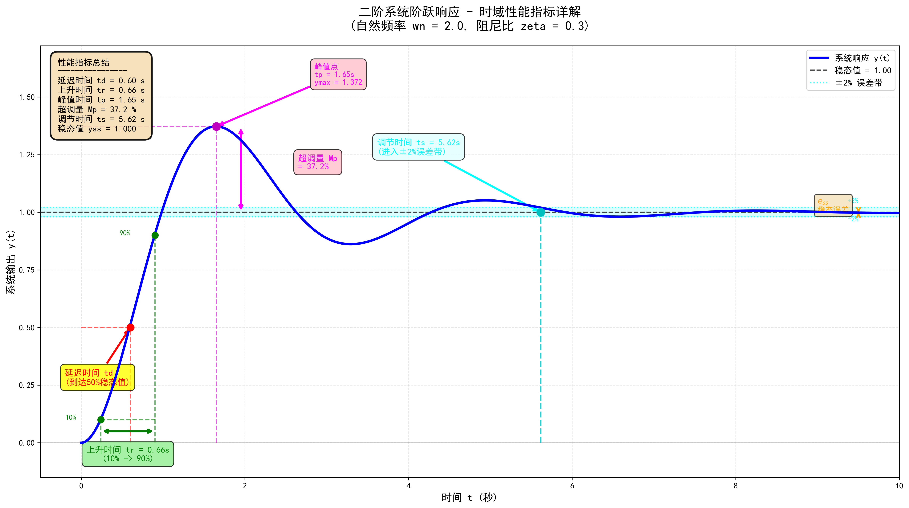

# 控制工程文档图表目录

本目录包含《第1章 控制工程基础》中使用的所有可视化图表。

## 📊 图表列表

### 1. 时域响应性能指标.png


**内容**：二阶欠阻尼系统的阶跃响应及性能指标详解

**标注指标**：
- 延迟时间 $t_d$（红色）
- 上升时间 $t_r$（绿色）
- 峰值时间 $t_p$（洋红色）
- 超调量 $M_p$（洋红色）
- 调节时间 $t_s$（青色）
- ±2%误差带（青色阴影区域）

**用途**：帮助理解时域分析中的各项性能指标定义

---

### 2. 控制系统框图.png


**内容**：典型闭环反馈控制系统结构图

**组成部分**：
- 设定值（Setpoint）
- 比较器（Comparator）
- 控制器（Controller）
- 执行器（Actuator）
- 被控对象（Plant）
- 传感器（Sensor）
- 反馈环路（Feedback Loop）

**用途**：展示控制系统的完整工作流程和信号传递

---

### 3. 开环vs闭环控制.png


**内容**：开环控制与闭环控制的结构对比

**对比要点**：
- **开环系统**：单向信号流，无反馈，无法自动补偿干扰
- **闭环系统**：反馈环路，自动调节，可补偿干扰

**特点对比**：
- 结构复杂度
- 抗干扰能力
- 适用场景
- 典型应用

**用途**：直观理解开环和闭环控制的本质区别

---

## 🔧 生成方法

所有图表由Python脚本自动生成，确保专业性和可复现性。

### 重新生成图表

```bash
# 在项目根目录下运行
python doc/generate_figures.py
```

### 生成特点

- **高分辨率**：300 DPI，适合打印和演示
- **专业配色**：使用matplotlib专业配色方案
- **详细标注**：每个概念都有清晰的文字说明和箭头指示
- **中文支持**：自动检测系统中文字体（SimHei/Microsoft YaHei等）
- **无警告输出**：优化了字体和日志配置

### 脚本功能

生成脚本 `../generate_figures.py` 提供以下功能：

1. **自动字体检测**
   - 自动搜索系统中可用的中文字体
   - 支持Windows、macOS、Linux多平台
   - 找不到中文字体时提供友好提示

2. **三个主要函数**
   - `generate_time_domain_response()` - 时域响应图
   - `generate_control_system_block_diagram()` - 控制系统框图
   - `generate_open_vs_closed_loop()` - 开环vs闭环对比图

3. **易于扩展**
   - 可以轻松添加新的图表生成函数
   - 支持修改系统参数（阻尼比、自然频率等）
   - 可自定义配色方案和标注风格

---

## 📝 使用建议

### 在Markdown中引用

```markdown

```

### 在LaTeX中引用

```latex
\begin{figure}[h]
  \centering
  \includegraphics[width=0.8\textwidth]{figures/时域响应性能指标.png}
  \caption{时域响应性能指标示意图}
  \label{fig:time_domain_response}
\end{figure}
```

### 在PPT/Word中使用

直接插入PNG图片即可，建议：
- 保持原始分辨率（300 DPI）
- 不要过度缩放以保持清晰度
- 配合文字说明使用效果更佳

---

## 🎨 自定义修改

### 修改系统参数

编辑 `generate_figures.py` 中的参数：

```python
# 二阶系统参数
wn = 2.0      # 自然频率
zeta = 0.3    # 阻尼比（0-1之间，<1为欠阻尼）
```

### 修改配色方案

```python
# 在各个生成函数中修改颜色
ax.plot(..., color='blue', ...)    # 主曲线颜色
ax.annotate(..., color='red', ...) # 标注颜色
```

### 添加新图表

1. 在 `generate_figures.py` 中添加新函数
2. 在 `if __name__ == "__main__":` 部分调用
3. 运行脚本生成

---

## 📚 相关文档

- [第1章 控制工程基础](../第1章_控制工程基础.md) - 主文档
- [课程大纲](../../CONTROL_ENGINEERING_OUTLINE.md) - 完整课程结构

---

**最后更新**: 2025年10月30日  
**生成工具**: Python + Matplotlib  
**作者**: Control Engineering Lab

