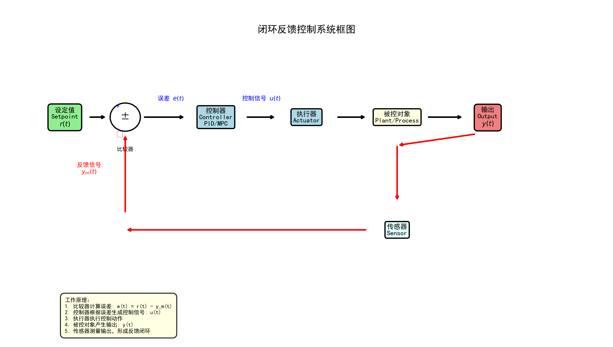
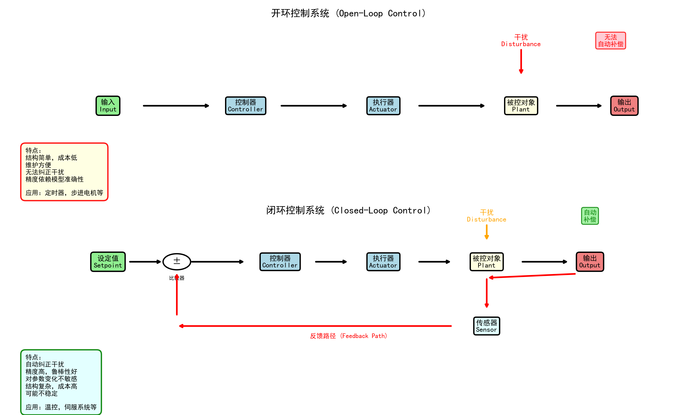
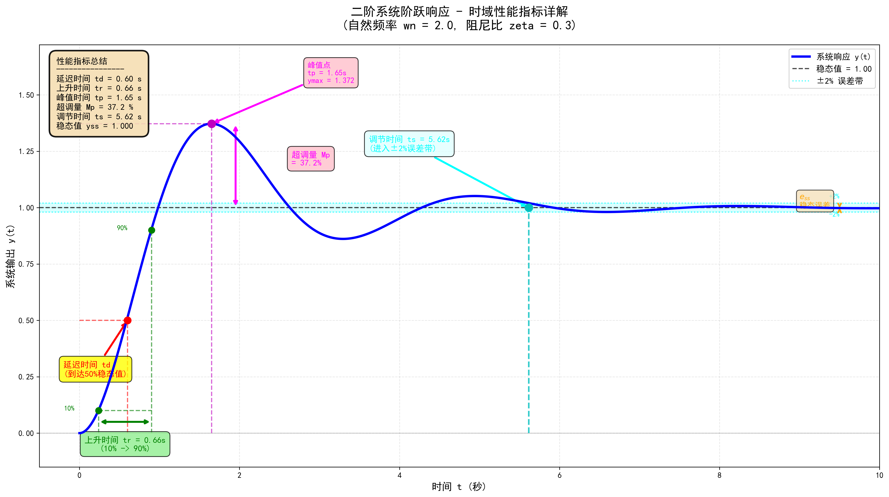

# 第1章 控制工程基础

> **课程大纲导航**: [返回课程大纲](../CONTROL_ENGINEERING_OUTLINE.md)

---

## 📚 本章概述

控制工程是研究如何使系统按照预期目标运行的学科。本章将介绍控制系统的基本概念、组成、分类以及建模方法，为后续学习打下坚实基础。

---

## 1.1 控制系统的定义与组成

### 1.1.1 什么是控制系统？

**控制系统**（Control System）是指能够对某一对象或过程进行自动调节，使其输出量达到预期目标的装置或系统。

**核心思想**：通过检测系统输出，与期望值比较，根据偏差调整输入，从而实现自动控制。

### 1.1.2 控制系统的基本组成

一个典型的控制系统包含以下几个基本环节：

```
        设定值(Setpoint)
              ↓
    ┌─────────[比较器]─────────┐
    │           ↓              │
    │        误差(Error)       │
    │           ↓              │
    │      [控制器]            │
    │      (Controller)        │
    │           ↓              │
    │    控制信号(u)           │
    │           ↓              │
    │      [执行器]            │
    │      (Actuator)          │
    │           ↓              │
    │    [被控对象]            │
    │    (Plant/Process)       │
    │           ↓              │
    │      输出(Output)        │
    │           ↓              │
    └───────[传感器]───────────┘
        (Sensor/Feedback)
```

**各组成部分说明**：

1. **被控对象（Plant/Process）**
   - 需要控制的系统或过程
   - 例如：温度、压力、速度、位置等
   - 特性：具有动态特性，存在惯性和延迟

2. **传感器（Sensor）**
   - 检测被控对象的实际输出
   - 将物理量转换为电信号
   - 例如：温度传感器、压力传感器、编码器等

3. **控制器（Controller）**
   - 系统的"大脑"，决策中心
   - 根据误差计算控制量
   - 常见类型：PID控制器、MPC控制器、状态反馈控制器等

4. **执行器（Actuator）**
   - 执行控制命令，对被控对象施加作用
   - 例如：电机、阀门、加热器、制冷器等

5. **比较器（Comparator）**
   - 计算设定值与实际值的偏差
   - 误差 = 设定值 - 实际值

### 1.1.3 控制系统框图



上图展示了典型闭环反馈控制系统的组成和信号流：

**工作原理**：
1. **设定值（Setpoint）** $r(t)$：系统期望达到的目标值
2. **比较器（Comparator）**：计算误差 $e(t) = r(t) - y_m(t)$
3. **控制器（Controller）**：根据误差生成控制信号 $u(t)$（如PID、MPC）
4. **执行器（Actuator）**：将控制信号转换为物理作用
5. **被控对象（Plant）**：需要控制的系统，产生输出 $y(t)$
6. **传感器（Sensor）**：测量实际输出，形成反馈信号 $y_m(t)$
7. **反馈环路**：闭环的关键，实现自动调节

### 1.1.4 实际案例：房间温度控制系统

**系统目标**：将房间温度维持在22°C

**信号流程**：
```
设定温度: 22°C
    ↓
[比较] ← 实际温度: 20°C (反馈)
    ↓
误差: +2°C
    ↓
[PID控制器] → 计算加热功率
    ↓
控制信号: 1500W
    ↓
[加热器] → 加热房间
    ↓
[房间] → 温度上升
    ↓
[温度传感器] → 测量温度
    ↓
反馈到比较器
```

---

## 1.2 开环控制与闭环控制

### 1.2.1 开环控制（Open-Loop Control）

**定义**：控制器的输出不受被控量影响，没有反馈环节。

**结构图**：
```
输入 → [控制器] → [执行器] → [被控对象] → 输出
```

**特点**：
- ✅ 结构简单，成本低
- ✅ 维护方便
- ❌ 无法自动纠正干扰
- ❌ 精度依赖于系统模型准确性
- ❌ 对参数变化敏感

**实际例子**：

1. **洗衣机定时控制**
   - 设定洗涤时间15分钟
   - 到时间自动停止
   - 不管衣服是否洗干净

2. **微波炉加热**
   - 设定加热时间3分钟
   - 不管食物温度如何

3. **交通信号灯**
   - 固定时间周期切换
   - 不考虑实际车流量

### 1.2.2 闭环控制（Closed-Loop Control / Feedback Control）

**定义**：根据输出的反馈信息，不断调整控制作用，使系统输出接近期望值。

**结构图**：
```
       设定值
          ↓
    ┌──[比较]←─────┐
    ↓              │
[控制器] → [执行器] → [被控对象] → 输出
                         │
                    [传感器]
                         │
                      反馈
```

**特点**：
- ✅ 能自动纠正干扰
- ✅ 对参数变化不敏感（鲁棒性）
- ✅ 精度高
- ❌ 结构复杂，成本高
- ❌ 可能不稳定（需要合理设计）

**实际例子**：

1. **空调温度控制**
   - 设定温度：26°C
   - 传感器持续检测室温
   - 温度高→制冷；温度低→停机或加热
   - 自动维持在设定值附近

2. **汽车定速巡航**
   - 设定速度：100 km/h
   - 传感器检测实际车速
   - 自动调整油门，保持恒速

3. **无人机飞行控制**
   - 设定高度、姿态
   - 多传感器反馈
   - 实时调整各电机转速

### 1.2.3 开环 vs 闭环对比



上图直观对比了开环和闭环控制系统的结构差异：
- **开环系统**：信号单向流动，干扰无法自动补偿
- **闭环系统**：通过反馈环路形成闭环，可自动纠正干扰

| 特性 | 开环控制 | 闭环控制 |
|------|----------|----------|
| **结构** | 简单 | 复杂 |
| **成本** | 低 | 高 |
| **精度** | 低 | 高 |
| **抗干扰能力** | 弱 | 强 |
| **稳定性** | 一般稳定 | 需要设计保证 |
| **适用场景** | 精度要求不高、干扰小 | 精度要求高、干扰大 |
| **典型应用** | 定时器、步进电机 | 温度控制、伺服系统 |

---

## 1.3 控制系统的基本环节

### 1.3.1 反馈环路（Feedback Loop）

反馈环路是闭环控制的核心，分为：

**1. 负反馈（Negative Feedback）**
- 反馈信号与输入信号相减
- 作用：减小误差，稳定系统
- 99%的控制系统采用负反馈

```
误差 = 设定值 - 反馈值
```

**2. 正反馈（Positive Feedback）**
- 反馈信号与输入信号相加
- 作用：放大偏差，导致不稳定
- 一般用于特殊场合（如信号放大、振荡器）

### 1.3.2 前馈控制（Feedforward Control）

**定义**：根据已知干扰或输入变化，提前调整控制量。

**结构**：
```
       设定值     干扰测量
          ↓          ↓
       [前馈控制器]  │
          ↓          ↓
    ┌──[比较]←───────┼───┐
    ↓                ↓   │
[反馈控制器] → [执行器] → [被控对象] → 输出
                            │
                       [传感器]
```

**优点**：
- 提前补偿，响应快
- 减轻反馈控制器负担

**缺点**：
- 需要准确测量干扰
- 需要准确的系统模型

**应用**：通常与反馈控制结合使用

### 1.3.3 串级控制（Cascade Control）

多个控制器串联，形成主副回路：

```
设定值 → [主控制器] → [副控制器] → [执行器] → [对象]
            ↑              ↑
         主回路反馈      副回路反馈
```

**优点**：
- 提高动态性能
- 更好的抗干扰能力

**应用**：温度控制、流量控制等

---

## 1.4 动态系统建模

### 1.4.1 为什么需要建模？

**建模的目的**：
1. 分析系统特性（稳定性、响应速度等）
2. 设计控制器
3. 仿真验证
4. 预测系统行为

**建模方法**：
- 机理建模：基于物理定律（牛顿定律、能量守恒等）
- 数据驱动建模：基于实验数据（系统辨识）
- 混合建模：机理+数据结合

### 1.4.2 微分方程描述

**基本形式**：

$$a_n \frac{d^n y}{dt^n} + \cdots + a_1 \frac{dy}{dt} + a_0 y = b_m \frac{d^m u}{dt^m} + \cdots + b_1 \frac{du}{dt} + b_0 u$$

其中：
- $y$: 输出
- $u$: 输入
- $a_i, b_j$: 系统参数

**一阶系统例子：RC电路**

$$\tau \frac{dy}{dt} + y = Ku$$

- $\tau$: 时间常数
- $K$: 增益

**二阶系统例子：弹簧-质量-阻尼系统**

$$m \frac{d^2y}{dt^2} + c \frac{dy}{dt} + k y = F$$

- $m$: 质量
- $c$: 阻尼系数
- $k$: 弹簧刚度

### 1.4.3 传递函数（Transfer Function）

**定义**：拉普拉斯变换后，输出与输入之比。

> **补充：什么是拉普拉斯变换 (Laplace Transform)？**
> 
> 拉普拉斯变换是一种将时域函数 $f(t)$ 转换到复频域函数 $F(s)$ 的数学工具，其定义为：
> 
> $$F(s) = \mathcal{L}\{f(t)\} = \int_0^\infty f(t) e^{-st} dt$$
> 
> 其中 $s = \sigma + j\omega$ 是复频率变量。
> 
> **为什么要使用拉普拉斯变换？**
> 1. **微分方程 → 代数方程**：将复杂的微分方程转化为简单的代数方程
>    - 时域: $\frac{dy}{dt}$ → 频域: $sY(s) - y(0)$
>    - 时域: $\frac{d^2y}{dt^2}$ → 频域: $s^2Y(s) - sy(0) - y'(0)$
> 
> 2. **便于分析系统特性**：极点、零点直接反映系统的稳定性和动态响应
> 
> 3. **简化卷积运算**：时域卷积 → 频域乘法
>    - 时域: $y(t) = h(t) * u(t)$ → 频域: $Y(s) = H(s) \cdot U(s)$
> 
> **常用拉普拉斯变换对照表**：
> 
> | 时域函数 $f(t)$ | 拉普拉斯变换 $F(s)$ | 说明 |
> |-------------------|---------------------|------|
> | $\delta(t)$ | $1$ | 单位脉冲 |
> | $1(t)$ | $\frac{1}{s}$ | 单位阶跃 |
> | $t$ | $\frac{1}{s^2}$ | 单位斜坡 |
> | $e^{-at}$ | $\frac{1}{s+a}$ | 指数函数 |
> | $\sin(\omega t)$ | $\frac{\omega}{s^2 + \omega^2}$ | 正弦函数 |
> | $\cos(\omega t)$ | $\frac{s}{s^2 + \omega^2}$ | 余弦函数 |
> | $\frac{df}{dt}$ | $sF(s) - f(0)$ | 一阶导数 |
> 
> **示例**：温度控制系统
> 
> 时域微分方程：
> $$C \frac{dT}{dt} = P - k(T - T_a)$$
> 
> 拉普拉斯变换后（假设初始条件为零）：
> $$C \cdot sT(s) = P(s) - k(T(s) - \frac{T_a}{s})$$
> 
> 整理得传递函数：
> $$\frac{T(s)}{P(s)} = \frac{1}{Cs + k}$$
> 
> 这就将微分方程转化为简单的代数形式！

**表达式**：

$$G(s) = \frac{Y(s)}{U(s)} = \frac{b_m s^m + \cdots + b_1 s + b_0}{a_n s^n + \cdots + a_1 s + a_0}$$

**一阶系统传递函数**：

$$G(s) = \frac{K}{\tau s + 1}$$

**二阶系统传递函数**：

$$G(s) = \frac{\omega_n^2}{s^2 + 2\zeta\omega_n s + \omega_n^2}$$

- $\omega_n$: 自然频率
- $\zeta$: 阻尼比

**优点**：
- 方便分析系统特性（极点、零点）
- 易于控制器设计
- 适合线性系统

**局限**：
- 仅适用于线性时不变系统
- 忽略初始条件
- 不适合多输入多输出系统（MIMO）

### 1.4.4 状态空间描述（State-Space Representation）

**基本形式**：

$$\dot{x} = Ax + Bu \quad \text{(状态方程)}$$

$$y = Cx + Du \quad \text{(输出方程)}$$

其中：
- $x$: 状态向量（$n$维）
- $u$: 输入向量（$m$维）
- $y$: 输出向量（$p$维）
- $A$: 状态矩阵（$n \times n$）
- $B$: 输入矩阵（$n \times m$）
- $C$: 输出矩阵（$p \times n$）
- $D$: 前馈矩阵（$p \times m$）

**例子：倒立摆系统**

状态: $x = [\text{位置}, \text{速度}, \text{角度}, \text{角速度}]^T$

输入: $u = \text{作用力}$

$$\dot{x} = \begin{bmatrix} 0 & 1 & 0 & 0 \\ 0 & 0 & a & 0 \\ 0 & 0 & 0 & 1 \\ 0 & 0 & c & 0 \end{bmatrix} \begin{bmatrix} x_1 \\ x_2 \\ x_3 \\ x_4 \end{bmatrix} + \begin{bmatrix} 0 \\ b \\ 0 \\ d \end{bmatrix} u$$

**优点**：
- 适用于多变量系统（MIMO）
- 便于计算机处理
- 现代控制理论基础
- 可处理非线性系统

**与传递函数的关系**：

$$G(s) = C(sI - A)^{-1}B + D$$

### 1.4.5 建模实例：房间温度系统

**物理模型**：

热量平衡：

$$C \frac{dT}{dt} = Q_{in} - Q_{loss}$$

其中：
- $Q_{in} = u$ （加热功率）
- $Q_{loss} = hA(T - T_{ambient})$ （散热）

简化得：

$$\tau \frac{dT}{dt} + T = Ku + T_{ambient}$$

**参数含义**：
- $C$: 热容（房间蓄热能力）
- $h$: 传热系数（房间保温性能）
- $A$: 散热面积
- $\tau = \frac{C}{hA}$: 时间常数
- $K = \frac{1}{hA}$: 增益

**传递函数**（增量形式）：

$$G(s) = \frac{K}{\tau s + 1}$$

**状态空间**：

$$\dot{x} = -\frac{1}{\tau}x + \frac{K}{\tau}u$$

$$y = x$$

**在本项目中的实现**：
参见 [MPC温度控制实验](MPC控制器说明.md#实验1-mpc温度控制推荐入门)

---

## 1.5 时域分析与频域分析基础

### 1.5.1 时域分析（Time-Domain Analysis）

**定义**：研究系统输出随时间变化的特性。

**典型输入信号**：

1. **阶跃输入（Step Input）**
   - 最常用的测试信号
   - $u(t) = A, \quad t \geq 0$
   - 检验系统的稳态性能

2. **脉冲输入（Impulse Input）**
   - 理想化信号
   - $\delta(t)$
   - 系统的脉冲响应 = 传递函数的拉普拉斯逆变换

3. **斜坡输入（Ramp Input）**
   - $u(t) = At$
   - 检验系统跟踪能力

**时域性能指标**：



上图展示了典型二阶欠阻尼系统的阶跃响应及各项性能指标的定义：

1. **延迟时间（Delay Time, $t_d$）**
   - 响应达到稳态值50%所需的时间
   - 反映系统初始响应的快慢

2. **上升时间（Rise Time, $t_r$）**
   - 从10%到90%稳态值的时间
   - 反映系统响应速度
   - $t_r$ 越小，系统响应越快

3. **峰值时间（Peak Time, $t_p$）**
   - 达到第一个峰值（最大值）的时间
   - 与系统阻尼比和自然频率相关

4. **超调量（Overshoot, $M_p$）**
   - $M_p = \frac{\text{最大值} - \text{稳态值}}{\text{稳态值}} \times 100\%$
   - 反映系统相对稳定性
   - 典型值：5%-20%为良好设计

5. **调节时间（Settling Time, $t_s$）**
   - 进入并保持在$\pm 2\%$（或$\pm 5\%$）误差带的时间
   - 反映系统到达稳态的快慢
   - $t_s$ 越小，系统越快达到稳定

6. **稳态误差（Steady-State Error, $e_{ss}$）**
   - $e_{ss} = \text{设定值} - \text{最终稳态值}$
   - 反映系统精度
   - 理想情况：$e_{ss} = 0$

### 1.5.2 频域分析（Frequency-Domain Analysis）

**定义**：研究系统对不同频率正弦输入的响应。

**频率响应函数**：

$$G(j\omega) = |G(j\omega)| \angle \phi(\omega)$$

- $|G(j\omega)|$: 幅频特性（增益）
- $\phi(\omega)$: 相频特性（相位）

**常用表示方法**：

1. **伯德图（Bode Plot）**
   - 横轴：频率$\omega$（对数坐标）
   - 纵轴：
     - 幅频：$20\log|G(j\omega)|$ (dB)
     - 相频：$\phi(\omega)$ (度)
   - 优点：易于分析和设计

2. **奈奎斯特图（Nyquist Plot）**
   - 极坐标图
   - 实轴：$\text{Re}[G(j\omega)]$
   - 虚轴：$\text{Im}[G(j\omega)]$
   - 用于稳定性判断

3. **尼科尔斯图（Nichols Plot）**
   - 横轴：相位
   - 纵轴：幅值（dB）
   - 结合幅频和相频

**频域性能指标**：

1. **增益裕度（Gain Margin, GM）**
   - 相位为$-180°$时的增益倒数
   - $\text{GM} > 1$（或$> 0$ dB）系统稳定

2. **相位裕度（Phase Margin, PM）**
   - 增益为1（0dB）时的相位与$-180°$的差
   - $\text{PM} > 0°$ 系统稳定

3. **带宽（Bandwidth, BW）**
   - 幅频下降到$-3$dB的频率
   - 反映系统响应速度

### 1.5.3 时域与频域的关系

| 时域特性 | 频域对应 |
|---------|---------|
| 响应速度快 | 带宽大 |
| 超调量小 | 相位裕度大 |
| 稳态误差小 | 低频增益大 |
| 系统稳定 | 增益/相位裕度充足 |

---

## 1.6 本章小结

### 核心概念回顾

1. **控制系统组成**：被控对象、传感器、控制器、执行器
2. **控制类型**：开环控制 vs 闭环控制
3. **建模方法**：微分方程、传递函数、状态空间
4. **分析方法**：时域分析、频域分析

### 知识体系

```
控制工程基础
    ├── 系统组成与分类
    │   ├── 开环/闭环
    │   ├── 反馈/前馈
    │   └── 单变量/多变量
    │
    ├── 系统建模
    │   ├── 微分方程
    │   ├── 传递函数
    │   └── 状态空间
    │
    └── 系统分析
        ├── 时域分析
        └── 频域分析
```

### 本项目中的实践

本章的理论在项目中有以下实现：

| 理论概念 | 项目实现 | 文件位置 |
|---------|---------|---------|
| **闭环控制** | PID温度控制 | `PIDController/pid_experiments.py` |
| **系统建模** | 一阶/二阶系统 | `PIDController/simulated_system.py` |
| **状态空间** | CartPole模型 | `PIDController/cartpole_pid.py` |
| **时域响应** | 阶跃响应实验 | `output/experiment_*.png` |
| **闭环反馈** | MPC温度控制 | `MPCController/mpc_temperature_control.py` |

### 学习建议

1. **理论与实践结合**
   - 先理解概念
   - 运行项目中的实验
   - 观察实际效果

2. **动手实验**
   ```bash
   # 运行PID实验，观察时域响应
   python start.py demo
   
   # 运行温度控制，理解闭环反馈
   python start.py mpc-temp
   ```

3. **深入思考**
   - 为什么需要反馈？
   - 开环和闭环各适合什么场景？
   - 如何选择建模方法？

---

## 📚 扩展阅读

### 推荐教材
1. **《自动控制原理》** - 胡寿松
2. **《现代控制工程》** - Katsuhiko Ogata
3. **《反馈控制系统》** - Franklin, Powell & Emami-Naeini

### 在线资源
1. MIT OpenCourseWare - Control Systems Engineering
2. Brian Douglas YouTube频道（控制理论讲解）
3. MATLAB Control Tutorials

### 下一步学习

- [第2章：一阶/二阶系统动力学与响应](第2章_系统动力学与响应.md)
- [第3章：PID控制与工程调节](使用说明.md)
- [第5章：先进控制方法入门（MPC）](MPC控制器说明.md)

---

> **导航**: [返回课程大纲](../CONTROL_ENGINEERING_OUTLINE.md) | [下一章：系统动力学与响应](第2章_系统动力学与响应.md)

---

**最后更新**: 2025年10月29日  
**作者**: Control Engineering Lab

